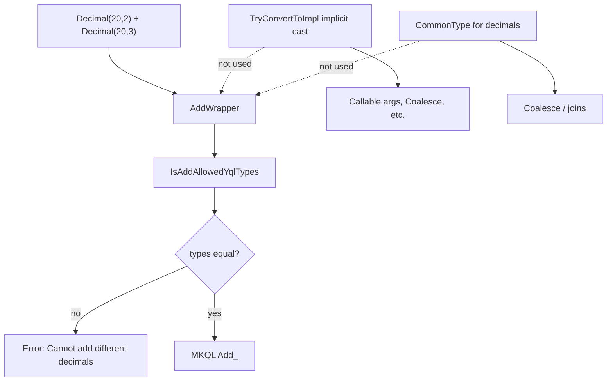

# Missing Support for Mixed-Precision Decimal Arithmetic in YQL

Analysis of why `SELECT Decimal("1.0",20,2)+Decimal("2.0",20,3)` fails on YDB stable (26-1-1) and `main`, relative to commit [222b685](https://github.com/ydb-platform/ydb/commit/222b68506a961b9228b5b27e189521b4a408bec1) (YQL-19261).

## Symptom

```sql
YQL> SELECT Decimal("1.0",20,2)+Decimal("2.0",20,3)
```

```
Status: GENERIC_ERROR
Error: Type annotation, code: 1030
    Error: At function: +
        Error: Cannot add different decimals.
```

## What commit 222b685 actually added

The commit title suggests arithmetic over decimals with various precisions, but the implementation is narrower.

### 1. Implicit decimal-to-decimal cast in coercion contexts

In `TryConvertToImpl` (`yql/essentials/core/yql_expr_type_annotation.cpp`), when a value must be converted to an *expected* decimal type:

- Reject if source scale > target scale (“would lose precision”).
- Reject if source integer digit count > target (“would narrow the range”).
- Otherwise allow implicit cast via `Cast`.

This applies when something drives conversion **to a known target type** (callable arguments, `TryConvertTo`, `Coalesce`-style unification via `SilentInferCommonType`). It does **not** apply to binary `+`.

### 2. Safer `ToDecimal` in MKQL

In `mkql_program_builder.cpp`, after `ScaleDown`, `CheckBounds` is invoked so narrowing casts can fail at runtime instead of silently truncating.

### 3. Tests

Added tests cover explicit `CAST` and passing a smaller decimal into a callable expecting a larger one (`cast_decimal.yql`). There are **no** tests for `Decimal(p1,s1) + Decimal(p2,s2)` with different `(p,s)`.

---

## Where the query fails

`AddWrapper` in `type_ann_core.cpp` calls `IsAddAllowedYqlTypes`, which for two decimals requires **exact** type equality:

```cpp
} else if (IsDataTypeDecimal(leftUnpacked->GetSlot()) && IsDataTypeDecimal(rightUnpacked->GetSlot())) {
    const auto dataTypeOne = static_cast<const TDataExprParamsType*>(leftUnpacked);
    const auto dataTypeTwo = static_cast<const TDataExprParamsType*>(rightUnpacked);

    if (!(*dataTypeOne == *dataTypeTwo)) {
        return std::unexpected(TString("Cannot add different decimals."));
    }
    commonType = leftUnpacked;
}
```

The same “identical decimals only” rule exists for:

| Operator / function | Location |
|---------------------|----------|
| `-` | `SubWrapper` in `type_ann_core.cpp` |
| `*`, `/`, `%` on decimals | `MulWrapper` / related paths in `type_ann_core.cpp` |
| `AggrAdd` | requires `IsSameAnnotation` on both operands |

Type annotation fails **before** any implicit-cast logic can run on the `+` node.

---

## What is missing (layer by layer)

### 1. Type annotation: common result type for arithmetic

`CommonType()` for two decimals already exists in `yql_expr_type_annotation.cpp` (used for coalesce/join-style unification, **not** for `+`):

```cpp
if (IsDataTypeDecimal(slot1) && IsDataTypeDecimal(slot2)) {
    const auto parts1 = GetDecimalParts(*one);  // {precision - scale, scale}
    const auto parts2 = GetDecimalParts(*two);
    // ... computes widened Decimal(whole + scale, scale)
}
```

For `Decimal(20,2) + Decimal(20,3)`, the natural result is **`Decimal(21, 3)`** (max integer width 18, max scale 3).

**Missing:** `IsAddAllowedYqlTypes`, `SubWrapper`, and decimal branches of `Mul`/`Div`/`%` should use this (or equivalent) instead of `*dataTypeOne == *dataTypeTwo`, and reject only if total precision exceeds `NDecimal::MaxPrecision`.

**Note on `main`:** YQL-20804 fixed the `CommonType` formula (`max` of integer parts and scales separately), but that change was **reverted** (`066dd770710`). Even wiring `CommonType` into `+` needs the corrected formula restored.

### 2. AST rewrite: coerce operands to the common type

`Coalesce` uses `SilentInferCommonType`, which may insert casts via `TryConvertToImpl`. **`AddWrapper` does not** — it only validates and assigns a result type.

**Missing:** Before or during typing of `+`, align both operands to the common `Decimal(p,s)` using the implicit-cast rules from 222b685.

### 3. Runtime (MKQL): identical operand types still required

```cpp
// mkql_program_builder.cpp — TProgramBuilder::Add
MKQL_ENSURE(rightType->IsSameType(*decimalType), "Operands type mismatch");
return Invoke(TString("Add_") += ::ToString(decimalType->GetParams().first), resultType, args);
```

`Sub` and `BuildArithmeticCommonType` enforce the same for decimals.

**Contrast:** `DataCompare` already aligns decimal scales via `ToDecimal` before comparison.

**Missing:** `Add`/`Sub` (and related lowering) should align operand types like `DataCompare`, then call `Add_<precision>` on the unified type.

### 4. Checked arithmetic expansion

`ExpandCheckedAdd` / `ExpandCheckedSub` / `ExpandCheckedMul` in `yql_opt_peephole_physical.cpp` build `SafeCast` trees but assume operands are already compatible. They depend on the same annotation and cast pipeline above.

### 5. Tests

No regression test for mixed-precision decimal `+`. The only “different decimals” SQL test (`win_range_wrong_bound_decimal`) **expects** the current error.

---

## Architecture (current vs required)



| Layer | Status for mixed-precision `+` |
|--------|--------------------------------|
| Implicit cast (222b685) | Done for target-driven coercion only |
| `IsAddAllowedYqlTypes` / `Sub` / `Mul` / `Div` | Still require identical `Decimal(p,s)` |
| `CommonType` for decimals | Exists but unused by arithmetic; pre-20804 formula on current `main` |
| Operand coercion on `+` | Missing (unlike `Coalesce`) |
| MKQL `Add`/`Sub` | Still `IsSameType` for decimals |

---

## What would make the example work

1. **Type rules:** In `IsAddAllowedYqlTypes` (and `-`, `*`, `/`, `%`), infer a common decimal result type instead of requiring equality; error if precision exceeds `NDecimal::MaxPrecision`.
2. **AST rewrite:** Cast both operands to that common type (reuse implicit-cast rules from 222b685).
3. **MKQL:** Align operand types in `Add`/`Sub` (as in `DataCompare`), then invoke `Add_<p>`.
4. **CommonType fix:** Re-apply YQL-20804 (or equivalent) if `CommonType` drives result typing.
5. **Tests:** e.g. `SELECT Decimal("1.0",20,2) + Decimal("2.0",20,3)` expecting `Decimal("3.0",21,3)` per the chosen result-type rule.

---

## Conclusion

Commit **222b685** added **implicit decimal casts when converting to an expected type** and safer scale-down in MKQL. It did **not** connect that machinery to **binary arithmetic**. The failure is therefore expected: type annotation still requires identical `Decimal(p,s)` for `+`, and lowering/runtime enforce the same constraint.

The gap is not missing decimal math in the engine; it is the **missing bridge** from implicit casts to binary operators — across type annotation, operand coercion, and MKQL lowering.

---

## Key file references

| File | Role |
|------|------|
| `yql/essentials/core/yql_expr_type_annotation.cpp` | `TryConvertToImpl`, `IsAddAllowedYqlTypes`, `CommonType`, `GetDecimalParts` |
| `yql/essentials/core/type_ann/type_ann_core.cpp` | `AddWrapper`, `SubWrapper`, `MulWrapper`, … |
| `yql/essentials/minikql/mkql_program_builder.cpp` | `Add`, `Sub`, `ToDecimal`, `DataCompare`, `BuildArithmeticCommonType` |
| `yql/essentials/core/peephole_opt/yql_opt_peephole_physical.cpp` | `ExpandCheckedAdd`, … |
