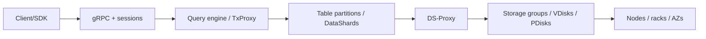
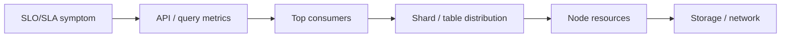
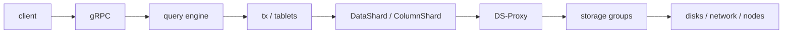

# Администрирование YDB как распределённой системы: структура и тезисы презентации

Материал рассчитан на 30-минутный доклад для инженеров эксплуатации, SRE, DBA и разработчиков, которые уже знакомы с классическими реляционными СУБД, но только начинают смотреть на YDB как на распределённую промышленную систему.

## Цель доклада

Показать, что администрирование YDB - это не "администрирование одного большого сервера с SQL", а управление распределённым контуром, где производительность и доступность складываются из состояния запросов, таблеток, шардов, узлов, сети, хранилища и клиентского поведения.

Ключевая мысль для аудитории:

> В классической СУБД администратор часто ищет "узкое место сервера". В YDB администратор сначала строит карту распределённого выполнения: где именно в цепочке "клиент -> gRPC -> query engine -> tablet/shard -> distributed storage -> сеть/железо" возникла задержка, очередь или дисбаланс.

## Рекомендуемый тайминг

| Время | Блок | Цель |
| --- | --- | --- |
| 0:00-2:00 | Зачем отдельный разговор про администрирование YDB | Настроить ожидания и обозначить отличие распределённой СУБД |
| 2:00-7:00 | Ментальная модель YDB | Объяснить узлы, таблетки, DataShard, разделение compute/storage |
| 7:00-12:00 | Чем это отличается от классической РСУБД и active/passive-кластера | Сравнить отказоустойчивость, ёмкость, деградации и роль схемы |
| 12:00-20:00 | Наблюдаемость: "100500 метрик" без паники | Показать слои сигналов, дашборды, системные представления и топы |
| 20:00-28:00 | Разбор инцидента: приложение стало медленнее | Пройти путь от симптома до причины и проверки исправления |
| 28:00-30:00 | Итоги и чек-лист администратора | Закрепить практический алгоритм |

## Структура слайдов

### Слайд 1. Заголовок и рамка разговора

**Тезисы:**

- Тема: "Администрирование YDB как распределённой системы".
- Фокус не на установке кластера, а на эксплуатационной модели: как думать о доступности, производительности и диагностике.
- За 30 минут: различия с классическими СУБД, наблюдаемость, пример расследования деградации.

**Что сказать:**

- "YDB умеет выглядеть как SQL-база для приложения, но для администратора это набор распределённых подсистем".
- "Если смотреть только на средний CPU кластера или один slow query log, можно пропустить реальную причину".

### Слайд 2. Почему привычки классической DBA-модели не всегда работают

**Тезисы:**

- В классической РСУБД основной объект наблюдения часто один инстанс или пара primary/standby.
- В active/passive-кластере есть понятный главный контур: активный узел обслуживает нагрузку, пассивный готовится принять роль.
- В YDB одновременно работают многие узлы, шарды, таблетки и группы хранения; "частичная деградация" нормальнее, чем бинарное "жив/мертв".
- В распределённой системе можно иметь свободный CPU по кластеру и одновременно один горячий шард, который тормозит пользовательский сценарий.

**Короткое сравнение:**

| Классическая РСУБД / active-passive | YDB как распределённая система |
| --- | --- |
| Узкое место часто ищется на уровне инстанса | Узкое место может быть в одном шарде, таблетке, пуле потоков, storage group или сетевом направлении |
| Failover - смена активной роли | Восстановление - переезды таблеток, репликация, деградация/восстановление групп хранения, балансировка |
| Capacity planning вокруг одного primary и резерва | Capacity planning по вычислительным узлам, storage-узлам, зонам, доменам отказа и запасу на отказ |
| Схема влияет на план запроса | Схема и первичный ключ ещё и задают распределение нагрузки |
| Slow query - частый главный артефакт | Нужны slow/top queries плюс топы партиций, метрики шардов, сети, CPU pools и хранилища |

### Слайд 3. Ментальная модель YDB для администратора

**Тезисы:**

- YDB построена как shared-nothing-система.
- Уровни compute и storage разделены логически и могут быть разнесены по разным наборам узлов.
- Stateful-единица вычислительного слоя - таблетка.
- Строковые таблицы партицируются по диапазонам первичного ключа; диапазоны обслуживаются DataShard-таблетками.
- Распределённое хранилище строится из PDisk, VDisk, Storage Group и DS-Proxy.

**Кандидат на визуализацию:**

```text
Client/SDK
   |
gRPC / sessions
   |
Query engine / TxProxy
   |
Table -> partitions -> DataShard tablets
   |
DS-Proxy
   |
Storage Groups -> VDisks -> PDisks
   |
Nodes / racks / availability zones
```

Та же схема в Mermaid:



**Что подчеркнуть:**

- "Таблица" в пользовательском смысле может быть множеством партиций.
- "Узел" - не единственный владелец данных, а место, где сейчас исполняются таблетки и обслуживаются части нагрузки.

### Слайд 4. Отказоустойчивость: не только переключить primary

**Тезисы:**

- Доступность базы зависит от двух контуров:
  - доступны ли группы хранения;
  - достаточно ли compute-ресурсов для запуска таблеток и обслуживания сессий.
- В topology важны fail domains и fail realms: серверы, стойки, дата-центры/зоны.
- При отказе зоны нагрузка на оставшиеся зоны растёт; запас CPU, RAM, I/O и storage throughput нужен заранее.
- Деградация может быть штатной, но заметной для latency: репликация, реконфигурация, переезды таблеток, split/merge.

**Фраза для слайда:**

> В distributed admin thinking отказ - это не событие "переключились и забыли", а период перераспределения нагрузки и восстановления избыточности.

### Слайд 5. Производительность: среднее по кластеру может врать

**Тезисы:**

- Средний CPU или общий RPS не показывают перекос.
- Важны распределения: percentiles, latency buckets, heatmaps, top shards, top queries.
- Один DataShard может стать горячим, хотя остальные ресурсы кластера свободны.
- Причины перекоса:
  - неудачный первичный ключ;
  - монотонно растущий ключ и "последняя" партиция;
  - отключённое партиционирование по нагрузке;
  - достигнут лимит числа партиций;
  - тяжёлый scan или запрос без эффективного доступа по ключу.

**Что сказать:**

- "В распределённой системе мы почти всегда спрашиваем: равномерно ли нагрузка разложилась по единицам исполнения?"

### Слайд 6. Что администрирует человек в YDB

**Тезисы:**

- Топологию: зоны, стойки, узлы хранения, узлы базы данных.
- Запас ресурсов: CPU pools, RAM, disk space, I/O bandwidth, сеть.
- Состояние распределённого хранилища: PDisks, VDisks, storage groups.
- Поведение таблеток: placement, moves, overload, split/merge.
- Схемы таблиц: первичные ключи, партиционирование, лимиты партиций.
- Клиентское поведение: retry policy, сессии, транзакции, размер запросов, prepared query cache.
- Наблюдаемость: метрики, логи, трассировки, system views, планы запросов.

**Практический вывод:**

- Администрирование YDB находится на стыке DBA, SRE и performance engineering.

### Слайд 7. Наблюдаемость: как не утонуть в "100500 метрик"

**Тезисы:**

- Не надо начинать с полного списка метрик; нужна воронка диагностики.
- Первый слой - пользовательский симптом: latency, errors, throughput.
- Второй слой - API и query engine: gRPC, sessions, query latency, compilation, cache.
- Третий слой - распределение нагрузки: DataShard, partition stats, top shards, top queries.
- Четвёртый слой - ресурсы узлов: CPU pools, memory, disk, network.
- Пятый слой - distributed storage и инфраструктура.

**Воронка:**

```text
SLO/SLA symptom
  -> API and query metrics
  -> query/top consumers
  -> shard/table distribution
  -> node resources
  -> storage/network/infrastructure
```

Та же схема в Mermaid:



**Что сказать:**

- "Метрик много не потому, что всё сложно ради сложности, а потому что нужно уметь отличить CPU bottleneck от hot shard, сетевой проблемы, storage latency или плохого запроса".

### Слайд 8. Базовый набор дашбордов и сигналов

**Тезисы:**

- **YDB Essential Metrics**: быстрый обзор здоровья, saturation, traffic, latency, errors.
- **DB overview**: Health, API, CPU, memory, storage, DataShard, latency.
- **CPU / Actors**: разбивка по execution pools: user, system, batch, IO, interconnect.
- **gRPC / Query engine**: запросы, inflight, bytes, sessions, latencies.
- **DataShard**: операции, транзакции, latency, compactions, ReadSets.
- **Database Hive**: таблеточный баланс, переезды таблеток, очереди Hive.
- **Topic / Topic Consumer**: если в контуре используются топики.

**Минимальный набор метрик для обсуждения:**

- latency: `table.query.execution.latency_milliseconds`, transaction latency percentiles;
- errors: gRPC response errors, YQL issues, `OVERLOADED`;
- traffic: requests per second, rows read/updated/deleted;
- sessions: `table.session.active_count`;
- query compilation: cache hits/misses, active compilations;
- CPU: `resources.cpu.used_core_percents` по пулам;
- memory/storage: `resources.memory.used_bytes`, `resources.storage.used_bytes`;
- shards: `table.datashard.used_core_percents`, read/write/scan rows and bytes, cache hit/miss.

### Слайд 9. Хит-парады: кто ест ресурсы и кто долго выполняется

**Тезисы:**

- В YDB есть системные представления `.sys` для анализа базы и кластера.
- Для запросов:
  - `.sys/top_queries_by_duration_one_minute` и `_one_hour`;
  - `.sys/top_queries_by_read_bytes_one_minute` и `_one_hour`;
  - `.sys/top_queries_by_cpu_time_one_minute` и `_one_hour`;
  - `.sys/query_metrics_one_minute`.
- Для партиций:
  - `.sys/partition_stats` - CPU, строки, размер, NodeId, TabletId, rejected by overload, lag.
- Для кластера:
  - `.sys/ds_pdisks`, `.sys/ds_vslots`, `.sys/ds_groups`, `.sys/ds_storage_pools`, `.sys/ds_storage_stats`.
- System views - диагностический инструмент, а не источник высокочастотного мониторинга; запросы к ним тоже создают нагрузку.

**Примеры запросов для слайда:**

Топ загруженных партиций:

```yql
SELECT
    Path,
    PartIdx,
    CPUCores,
    NodeId,
    TabletId
FROM `.sys/partition_stats`
ORDER BY CPUCores DESC
LIMIT 10;
```

Топ запросов по чтению:

```yql
SELECT
    IntervalEnd,
    QueryText,
    ReadBytes,
    ReadRows,
    Partitions
FROM `.sys/top_queries_by_read_bytes_one_minute`
WHERE Rank = 1;
```

Запросы, которые суммарно съели больше CPU:

```yql
SELECT
    SumCPUTime,
    Count,
    MaxDuration,
    QueryText,
    IntervalEnd
FROM `.sys/query_metrics_one_minute`
ORDER BY SumCPUTime DESC
LIMIT 10;
```

### Слайд 10. Метрики надо читать слоями, а не по алфавиту

**Тезисы:**

- **Latency выросла, RPS не вырос:** смотреть storage latency, network, CPU steal/overcommit, tablet moves, locks.
- **Latency выросла вместе с RPS:** смотреть CPU pools, DataShard heatmaps, top partitions, query mix.
- **Ошибки `OVERLOADED`:** искать hot shard, лимит очереди, неправильные retry, превышение лимитов.
- **CPU кластера высокий:** разделить user/system/batch/IO/interconnect pools и посмотреть actor/query breakdown.
- **CPU кластера невысокий, но приложение медленное:** искать дисбаланс по шардам, одну горячую партицию, сетевое направление, storage group.
- **Резко выросли compilation latency/cache misses:** смотреть prepared queries, параметры, генерацию уникальных текстов запросов.
- **p99 растёт, p50 нормальный:** искать хвосты - отдельные узлы, отдельные шарды, отдельные запросы, network/storage tail latency.

**Главный тезис:**

> Метрики YDB полезны, когда они отвечают на вопрос "на каком слое появилась очередь?".

### Слайд 11. Инструменты кроме Grafana

**Тезисы:**

- **Embedded UI**:
  - состояние кластера, tenant view, узлы, storage, compute;
  - HealthCheck;
  - Schema, Query, Top queries, Top shards;
  - Network view.
- **YDB CLI**:
  - healthcheck;
  - describe схемы;
  - explain/explain analyze;
  - workload для воспроизведения и проверки гипотез.
- **Планы запросов**:
  - искать full scan, лишние joins, неверную селективность, число затронутых шардов;
  - сравнивать логический план и runtime-статистику.
- **Логи и трассировка**:
  - нужны, когда метрики показывают слой, но не объясняют конкретное событие.

**Что сказать:**

- "Grafana отвечает на вопрос 'что и когда'. System views и UI помогают ответить 'кто именно'. План запроса и трассировка - 'почему именно так'".

### Слайд 12. Пример инцидента: приложение стало медленнее

**Сценарий:**

- Команда приложения сообщает: "p95 чтения вырос, пользователи видят задержки".
- Запросы простые: key-value `SELECT` по первичному ключу.
- Ошибок почти нет, но latency выросла в 2-3 раза.
- RPS вырос примерно с 27k до 35k.

**Первичные гипотезы:**

1. Кластеру не хватает CPU.
2. Хранилище стало медленнее.
3. Сеть или interconnect дают хвосты.
4. Появился тяжёлый запрос.
5. Одна партиция/таблица стала горячей.

**Правило расследования:**

- Не спорить гипотезами, а быстро проверять их по слоям.

### Слайд 13. Шаг 1 расследования: подтвердить симптом на стороне YDB

**Действия:**

- Открываем **DB overview** или **YDB Essential Metrics**.
- Смотрим query/transaction latency percentiles и latency buckets.
- Смотрим requests per second и errors.

**Наблюдения:**

- p50/p95/p99 выросли в тот же момент, что и жалобы приложения.
- RPS вырос, но не выглядит экстремальным для всего кластера.
- Ошибок мало или они вторичны.

**Вывод:**

- Проблема видна на стороне базы, но пока не понятно, это общий capacity или локальный дисбаланс.

### Слайд 14. Шаг 2: общий capacity или локальный bottleneck?

**Действия:**

- Смотрим CPU by execution pool.
- Смотрим memory/storage.
- Смотрим API details и sessions.
- Сравниваем p95/p99 с CPU saturation.

**Наблюдения из типового кейса:**

- CPU вырос в user/interconnect pools, но кластер в целом не исчерпал все CPU-ресурсы.
- Нет явного "все узлы упёрлись в 100%".
- Значит, нужно искать не средний CPU, а перекос.

**Вывод:**

- Переходим к DataShard и распределению нагрузки по партициям.

### Слайд 15. Шаг 3: находим горячий DataShard

**Действия:**

- В Grafana смотрим **DataShard details**:
  - read/write/scan throughput;
  - shard distribution by workload;
  - **Overloaded shard count**.
- В Embedded UI открываем **Diagnostics -> Top shards** или вкладку таблицы **Top shards**.
- Дополнительно проверяем `.sys/partition_stats`.

**Наблюдения:**

- Один DataShard ушёл в высокий bucket CPU, например 60-70%.
- Top shards показывает конкретную таблицу, например `kv_test`.
- Остальные шарды не выглядят столь же нагруженными.

**Ключевое объяснение:**

- DataShard - однопоточный компонент и обрабатывает запросы последовательно.
- Если очередь растёт, растёт latency.
- При достижении предельной очереди новые запросы получают `OVERLOADED`.

### Слайд 16. Шаг 4: причина и исправление

**Проверки:**

- Открыть **Diagnostics -> Info** для таблицы.
- Проверить:
  - `Partitioning by load`;
  - `PartCount`;
  - лимит числа партиций;
  - форму первичного ключа.

**Типовая причина в примере:**

- Таблица создана с одной партицией.
- Автоматическое партиционирование по нагрузке выключено.
- Все запросы попадают в один DataShard.

**Исправление для этого случая:**

```yql
ALTER TABLE kv_test SET (
    AUTO_PARTITIONING_BY_LOAD = ENABLED
);
```

**Если причина не в этом:**

- Если достигнут `AUTO_PARTITIONING_MAX_PARTITIONS_COUNT` - увеличить лимит.
- Если hot key вызван моделью данных - менять ключ или добавлять распределяющий компонент, например хеш.
- Если виноват запрос - оптимизировать YQL, индекс, план, количество затронутых шардов.

### Слайд 17. Шаг 5: проверяем, что стало лучше

**Действия:**

- Проверяем, что партиций стало больше.
- Смотрим, исчез ли перегруженный shard bucket.
- Сравниваем latency percentiles до/после.
- Смотрим RPS, errors, queue/overload.
- Проверяем, не создали ли новую проблему: split/merge storm, рост storage или CPU.

**Ожидаемый результат в примере:**

- DataShard разделился.
- Нагрузка распределилась между несколькими шардами.
- p50/p95 вернулись ближе к прежним значениям.
- Исправление не потребовало добавления железа, потому что проблема была в распределении нагрузки.

**Главный урок:**

> В распределённой базе "добавить CPU" не всегда лечит latency. Иногда нужно дать системе возможность распараллелить работу.

### Слайд 18. Чек-лист администратора для деградации производительности

**Тезисы:**

1. Зафиксировать время начала, affected workload и пользовательский симптом.
2. Проверить latency/errors/throughput на уровне базы.
3. Сравнить с изменениями: релиз приложения, DDL, конфиг, rolling restart, рост нагрузки, учения ДЦ.
4. Разделить гипотезы:
   - общий capacity;
   - локальный hot shard;
   - медленный запрос;
   - storage/network;
   - locks/transactions;
   - клиентские retries/sessions.
5. Найти "кто именно":
   - top queries;
   - query metrics;
   - top shards;
   - partition stats;
   - node/storage views.
6. Исправить минимально достаточным действием.
7. Проверить до/после по тем же метрикам.
8. Добавить алерт или дашборд на ранний сигнал.

### Слайд 19. Финальные выводы

**Тезисы:**

- YDB скрывает распределённость от приложения, но не от эксплуатации.
- Главное отличие от active/passive РСУБД - много независимых единиц отказа, нагрузки и балансировки.
- Хороший администратор YDB смотрит не только "сколько CPU", но и "где очередь и насколько равномерно распределена работа".
- "100500 метрик" превращаются в рабочий инструмент, если идти слоями: SLO -> API -> query -> shard -> node -> storage/network.
- Самые полезные хит-парады: долгие запросы, CPU-heavy запросы, read-heavy запросы, горячие партиции, проблемные узлы и группы хранения.
- Постоянный вопрос при деградации: "это общий предел системы или локальный перекос?"

## Визуализации для слайдов

Ниже приведён сториборд возможных визуализаций. Его можно использовать как бриф для дизайнера, генератора изображений или ручной сборки слайдов. Для слайдов с Mermaid-диаграммами лучше оставить диаграмму основной визуализацией, а иллюстрацию использовать только как фоновый акцент.

| Слайд | Визуальная идея | Композиция для landscape | Ключевые элементы / промпт |
| --- | --- | --- | --- |
| 1. Заголовок и рамка разговора | Абстрактный распределённый кластер как "карта системы" | Слева крупный заголовок, справа сеть узлов и линий связи; один узел подсвечен как точка внимания администратора | Тёмный фон, сине-зелёные линии, несколько групп узлов, мягкое свечение, технологичный стиль без перегруза |
| 2. Почему привычки DBA-модели не всегда работают | Контраст "один сервер" против "распределённая система" | Две половины: слева один database server с standby, справа множество узлов, шардов и storage groups | Split-screen, слева простая active/passive пара, справа сетка компонентов; акцент на том, что справа есть локальные горячие точки |
| 3. Ментальная модель YDB для администратора | Использовать подготовленную текстовую/Mermaid-схему как основной визуал | Горизонтальная цепочка слоёв через всю ширину слайда | Дополнительно можно добавить небольшие пиктограммы: client, API, query engine, shards, storage, infrastructure |
| 4. Отказоустойчивость: не только переключить primary | Период перераспределения нагрузки после отказа зоны | Три зоны доступности в ряд; одна затемнена, стрелки нагрузки уходят в две оставшиеся зоны | Availability zones, fail domain, перераспределение таблеток, тонкая линия "recovery in progress"; без драматичных аварийных образов |
| 5. Производительность: среднее по кластеру может врать | Heatmap с одним горячим шардом | Большая матрица маленьких ячеек; почти все зелёные/синие, одна оранжево-красная | Подпись "cluster average OK" и локальный hotspot; визуально показать, что среднее скрывает проблему |
| 6. Что администрирует человек в YDB | Операционная карта ответственности администратора | В центре "YDB admin", вокруг 6-7 карточек: topology, resources, storage, tablets, schema, clients, observability | Радиальная схема или dashboard wall; карточки одинакового размера, чтобы показать баланс ролей DBA/SRE/performance |
| 7. Наблюдаемость: как не утонуть в "100500 метрик" | Использовать подготовленную воронку как основной визуал | Воронка слева направо или сверху вниз; справа короткий список вопросов к каждому слою | Можно добавить фон из полупрозрачных metric lines, но не перегружать цифрами |
| 8. Базовый набор дашбордов и сигналов | Стена дашбордов с выделенным "minimum useful set" | Сетка из мини-панелей Grafana-like; 5-6 панелей подсвечены рамкой | Latency percentiles, errors, CPU pools, DataShard heatmap, sessions, storage; стиль mock dashboard без реальных данных |
| 9. Хит-парады: кто ест ресурсы и кто долго выполняется | Табло "top consumers" | Три вертикальные карточки: top queries by duration, top queries by CPU, top hot partitions | Использовать медали/rank 1-3, но в техническом стиле; рядом маленькие SQL/system view строки |
| 10. Метрики надо читать слоями, а не по алфавиту | Decision tree для выбора следующего слоя диагностики | Слева symptoms, справа несколько веток к API, queries, shards, nodes, storage/network | Небольшое дерево решений: "latency + RPS?", "p99 only?", "`OVERLOADED`?"; акцент на маршрутизацию мышления |
| 11. Инструменты кроме Grafana | Набор инструментов расследования | Горизонтальный toolbelt: Grafana, Embedded UI, CLI, Query plan, Logs, Tracing | Каждая иконка с короткой подписью: "what/when", "who", "why", "sequence"; без привязки к конкретным логотипам, если их нельзя использовать |
| 12. Пример инцидента: приложение стало медленнее | Таймлайн инцидента | Широкая временная шкала: normal -> 10:20 latency grows -> investigation starts | На линии график latency p95, рядом карточка "app report"; использовать спокойный incident-room стиль |
| 13. Шаг 1: подтвердить симптом на стороне YDB | График latency buckets / percentiles | Слева пользовательская жалоба, справа подтверждение на DB overview | Показать p50/p95/p99 линии, рост после вертикальной отметки времени; без точных чисел, если нет реального графика |
| 14. Шаг 2: общий capacity или локальный bottleneck? | Развилка гипотез capacity vs skew | Слева индикатор общего CPU не красный, справа увеличительное стекло над одним компонентом | Визуальная мысль: "ресурсы в среднем есть, ищем локальный перекос"; полезен split layout |
| 15. Шаг 3: находим горячий DataShard | Увеличение из heatmap в конкретную таблицу | Слева heatmap DataShard, справа zoom-in карточка `kv_test` / hot DataShard | Одна ячейка выделена, стрелка к Top shards; подписи "67% CPU", "single DataShard" можно оставить условными |
| 16. Шаг 4: причина и исправление | До/после партиционирования | Слева одна крупная перегруженная партиция, справа две или несколько более спокойных партиций | Добавить маленький code badge `ALTER TABLE ... AUTO_PARTITIONING_BY_LOAD = ENABLED`; показать распараллеливание |
| 17. Шаг 5: проверяем, что стало лучше | Before/after validation | Два графика рядом: latency до и после, hot shard count до и после | Акцент на одинаковые метрики до/после; зелёная отметка "same checks, better distribution" |
| 18. Чек-лист администратора | Incident checklist | Слева чек-лист из 8 пунктов, справа вертикальная цепочка "symptom -> hypothesis -> consumer -> fix -> verify" | Использовать чекбоксы и короткие глаголы; это должен быть самый практичный слайд |
| 19. Финальные выводы | Три ключевые идеи в виде карточек | Три большие карточки по горизонтали: distribution, layers, top consumers | Финальный спокойный визуал: "не среднее, а распределение", "идти слоями", "искать конкретного потребителя" |

## Проект возможного текста доклада

Ниже приведён черновой текст, который можно использовать как основу для speaker notes. Его не обязательно произносить дословно: часть формулировок лучше адаптировать под уровень аудитории, реальные слайды и конкретный контур эксплуатации. Маркеры `Переключение на слайд N` помогают сопоставить рассказ с предложенной выше структурой слайдов.

### 0:00-2:00. Вступление

> **Переключение на слайд 1. Заголовок и рамка разговора**

Коллеги, сегодня я хочу поговорить про администрирование YDB как распределённой системы.

С одной стороны, YDB может выглядеть для приложения довольно привычно: есть таблицы, SQL-подобный язык YQL, транзакции, SDK, запросы на чтение и запись. Поэтому легко попасть в ловушку и начать думать о ней как о "ещё одной SQL-базе", только большой.

Но для администратора и инженера эксплуатации это не совсем так. Внутри YDB запрос проходит через несколько распределённых слоёв: клиент и gRPC, query engine, транзакционный слой, таблетки и шарды, распределённое хранилище, сеть, физические узлы и зоны доступности. И когда приложение говорит "база стала медленнее", нам нужно понять не только то, какой запрос стал медленным, но и где именно в этой цепочке появилась очередь, деградация или перекос нагрузки.

> **Переключение на слайд 2. Почему привычки классической DBA-модели не всегда работают**

В классической базе данных мы часто начинаем с вопроса: что происходит с сервером? CPU, память, диски, блокировки, slow queries. В YDB этот вопрос остаётся важным, но он становится недостаточным. Нужно спрашивать иначе: равномерно ли распределена нагрузка, нет ли горячего шарда, не переезжают ли таблетки, не деградировала ли storage group, нет ли проблем в interconnect, не создаёт ли приложение каскад повторов.

Цель доклада - дать практическую ментальную модель. Не выучить все метрики YDB, их действительно много, а научиться идти по слоям и быстро сужать пространство поиска.

### 2:00-7:00. Ментальная модель YDB

> **Переключение на слайд 3. Ментальная модель YDB для администратора**

Начнём с базовой картины.

YDB - это горизонтально масштабируемая shared-nothing-система. Это значит, что мы не пытаемся сделать один огромный сервер базы данных. Вместо этого нагрузка и данные раскладываются по множеству узлов и внутренних компонентов.

В YDB логически разделены вычисления и хранение. Они могут жить на разных наборах узлов или быть совмещены на одних физических машинах, но для понимания эксплуатации полезно разделять эти уровни в голове. Узлы базы данных запускают вычислительную логику, обслуживают сессии, запросы, транзакции и таблетки. Узлы хранения обеспечивают сохранность данных через распределённое хранилище.

Одна из ключевых внутренних сущностей - таблетка. Это stateful-компонент, который отвечает за конкретную часть работы. Для строковых таблиц важный тип таблетки - DataShard. Строковая таблица физически разбивается на диапазоны по первичному ключу, и каждый такой диапазон обслуживается DataShard-таблеткой.

Для пользователя таблица может выглядеть как один объект: `orders`, `payments`, `users`. Но для администратора это может быть десятки, сотни или тысячи партиций. И если одна партиция перегружена, пользовательский сценарий может тормозить, даже если по кластеру в среднем всё выглядит неплохо.

Дальше, ниже таблеток, находится распределённое хранилище. Упрощённо можно думать о цепочке так: таблетка обращается к DS-Proxy, DS-Proxy скрывает детали распределённого storage, данные лежат в Storage Groups, которые состоят из VDisk, а VDisk размещены на PDisk, то есть физических блочных устройствах.

Для администратора это означает важную вещь: "база работает" - это не одно состояние. Может быть жив query engine, но конкретная группа хранения имеет повышенную задержку. Может быть достаточно свободной памяти, но один execution pool перегружен. Может быть нормальный общий RPS, но один DataShard стал горячим.

Поэтому я предлагаю держать в голове цепочку:

```text
client -> gRPC -> query engine -> transaction/tablet layer -> DataShard/ColumnShard -> DS-Proxy -> storage groups -> disks/network/nodes
```

Та же схема в Mermaid:



Когда мы диагностируем проблему, мы идём по этой цепочке сверху вниз или снизу вверх, но всегда пытаемся ответить на один вопрос: на каком слое возникла очередь или дисбаланс?

### 7:00-12:00. Чем это отличается от классической РСУБД и active/passive-кластера

Теперь сравним эту модель с более привычной для многих эксплуатацией классической реляционной СУБД.

В классическом варианте у нас часто есть primary-инстанс, который обслуживает запись и основную нагрузку, и standby или passive-узел, который нужен для failover. Даже если вокруг есть репликация, балансировщик, кластерный менеджер и shared storage, основная операционная картина остаётся довольно централизованной. Мы смотрим на активный узел, на его CPU, memory, disk latency, locks, wait events, slow queries.

В active/passive-модели отказоустойчивость часто воспринимается как переключение роли. Был active на одном сервере, стал active на другом. Конечно, там тоже много деталей: lag, fencing, split brain, восстановление, прогрев кешей. Но всё равно событие часто описывается как "переключились".

> **Переключение на слайд 4. Отказоустойчивость: не только переключить primary**

В YDB отказ и деградация выглядят иначе. Здесь много независимых единиц размещения и балансировки: узлы, таблетки, партиции, storage groups, fail domains, зоны доступности. При сбое часть таблеток может переехать, часть групп хранения может перейти в деградированное состояние, оставшиеся зоны могут получить дополнительную нагрузку, система может начать восстановление избыточности. Это не всегда бинарная история "работает или не работает"; часто это период частичной деградации, в котором важно понимать, какие пользовательские нагрузки затронуты.

Отсюда первое отличие: capacity planning. В классической базе мы часто планируем мощность primary и запас для standby. В YDB нужно планировать запас по compute-узлам, storage-узлам, сети, дискам, зонам и доменам отказа. Если кластер должен переживать отказ зоны, то оставшиеся зоны должны иметь достаточный запас CPU, RAM, I/O и storage throughput.

> **Переключение на слайд 5. Производительность: среднее по кластеру может врать**

Второе отличие - роль схемы данных. В обычной РСУБД первичный ключ и индексы, конечно, влияют на планы запросов и блокировки. В YDB первичный ключ дополнительно влияет на физическое распределение нагрузки. Если ключ монотонно растёт, например timestamp или sequence-like значение, можно получить горячую последнюю партицию. Если автоматическое партиционирование по нагрузке выключено или ограничено слишком низким лимитом партиций, система не сможет достаточно распараллелить поток запросов.

Третье отличие - диагностика. Slow query важен, но его мало. Нужны ещё top shards, partition stats, распределение DataShard по CPU, latency buckets, метрики gRPC, CPU pools, состояние storage groups и сети.

И самое практическое отличие: среднее значение по кластеру может врать. Можно видеть 40% CPU по базе и при этом иметь один горячий DataShard, через который проходит критичный пользовательский сценарий. Поэтому распределённую систему нельзя администрировать только средними значениями. Нужны распределения, перцентили и "хит-парады" конкретных потребителей.

> **Переключение на слайд 6. Что администрирует человек в YDB**

Если собрать это в эксплуатационную карту, администратор YDB смотрит сразу на несколько плоскостей: топологию и зоны отказа, запас compute и storage, состояние распределённого хранилища, размещение и поведение таблеток, схему таблиц и первичные ключи, клиентские retry и сессии, а также метрики, логи, трассировки и планы запросов. Поэтому роль администратора здесь ближе к пересечению DBA, SRE и performance engineering.

### 12:00-16:00. Наблюдаемость: как не утонуть в метриках

> **Переключение на слайд 7. Наблюдаемость: как не утонуть в "100500 метрик"**

Теперь про наблюдаемость.

В YDB действительно много метрик. Это нормально для распределённой системы: разные слои должны уметь объяснить разные типы деградации. Проблема начинается, если открыть полный список метрик и пытаться читать его сверху вниз. Так делать не надо.

Лучше использовать воронку.

Первый слой - пользовательский симптом. Что именно случилось? Вырос p95? Вырос p99? Упала пропускная способность? Появились `OVERLOADED` или gRPC errors? Проблема у всех запросов или у одного сценария? С какого времени?

Второй слой - API и query engine. Здесь смотрим RPS, bytes, requests in flight, sessions, query latency, transaction latency, compilation latency, cache hits и misses. Этот слой отвечает на вопрос: изменилась ли входящая нагрузка и как база принимает запросы.

Третий слой - распределение нагрузки. Здесь появляются DataShard, top shards, partition stats, top queries. Мы спрашиваем: равномерно ли работа разложилась по партициям и узлам? Нет ли одного потребителя, который съел непропорционально много CPU, строк или байт?

Четвёртый слой - ресурсы узлов. CPU нужно смотреть не только суммарно, но и по execution pools: user, system, batch, IO, interconnect. Высокий user pool - это одна история, высокий interconnect - другая, высокий IO pool - третья. Память, диски и сеть тоже нужно смотреть по узлам, а не только в агрегате.

Пятый слой - distributed storage и инфраструктура. Здесь нас интересуют группы хранения, VDisk, PDisk, деградация, latency операций хранения, место на дисках, сетевые задержки и проблемы зон доступности.

> **Переключение на слайд 8. Базовый набор дашбордов и сигналов**

По дашбордам минимальный набор такой.

**YDB Essential Metrics** хорош как стартовая панель: health, saturation, traffic, latency, errors. Это место, где удобно подтвердить, что проблема действительно видна на стороне базы.

**DB overview** даёт более подробную картину по API, CPU, memory, storage, DataShard и latency.

**CPU** и **Actors** помогают понять, какие execution pools и акторы потребляют CPU.

**gRPC** и **Query engine** отвечают за входящий слой: сколько запросов, какие методы, сколько inflight, какие задержки.

**DataShard** и DataShard details нужны, когда подозреваем горячие партиции, split/merge, очереди и перегрузку.

**Database Hive** полезен, если есть подозрение на массовые переезды таблеток, проблемы балансировки или нагрузку на Hive.

Если в системе используются топики, отдельно смотрим **Topic** и **Topic Consumer**: lag, throttling, active sessions, end-to-end latency.

### 16:00-20:00. Хит-парады и системные представления

> **Переключение на слайд 9. Хит-парады: кто ест ресурсы и кто долго выполняется**

Теперь про "хит-парады". Это очень важная идея для эксплуатации распределённой системы.

Когда у нас много узлов, шардов и запросов, вопрос "что тормозит?" лучше заменить на серию более конкретных вопросов:

- какой запрос выполнялся дольше всего;
- какой запрос прочитал больше всего байт;
- какой запрос съел больше всего CPU;
- какая партиция сейчас самая горячая;
- какая таблица создаёт больше всего чтений или записей;
- какие storage groups или узлы выглядят проблемными.

Для этого в YDB есть системные представления с префиксом `.sys`.

Для запросов полезны:

- `.sys/top_queries_by_duration_one_minute` и часовой вариант;
- `.sys/top_queries_by_read_bytes_one_minute`;
- `.sys/top_queries_by_cpu_time_one_minute`;
- `.sys/query_metrics_one_minute`.

Их можно использовать, чтобы увидеть не просто "медленно", а конкретный текст запроса, длительность, количество прочитанных строк и байт, число затронутых шардов, CPU time, compile duration и другие характеристики.

Для партиций есть `.sys/partition_stats`. Это один из ключевых инструментов, когда мы ищем перекос. Там можно увидеть путь таблицы, номер партиции, CPUCores, NodeId, TabletId, размер данных, количество строк, in-flight транзакции, rejected by overload и другие поля.

Например, топ горячих партиций:

```yql
SELECT
    Path,
    PartIdx,
    CPUCores,
    NodeId,
    TabletId
FROM `.sys/partition_stats`
ORDER BY CPUCores DESC
LIMIT 10;
```

Это очень прямой ответ на вопрос: "кто сейчас ест CPU на уровне партиций?"

Для кластера есть системные представления распределённого хранилища: `ds_pdisks`, `ds_vslots`, `ds_groups`, `ds_storage_pools`, `ds_storage_stats`. Они нужны, когда проблема похожа на storage-level деградацию, нехватку места, деградацию группы или неравномерное размещение.

> **Переключение на слайд 10. Метрики надо читать слоями, а не по алфавиту**

Перед тем как переходить к дополнительным инструментам, полезно зафиксировать правило чтения метрик. Мы не листаем их по алфавиту. Мы формулируем симптом и выбираем слой. Если latency выросла вместе с RPS, смотрим CPU pools, DataShard heatmaps и query mix. Если latency выросла без роста RPS, проверяем storage, network, tablet moves, locks и хвосты по узлам. Если p99 растёт, а p50 нормальный, ищем отдельные шарды, узлы, запросы или сетевые направления. Метрики должны отвечать на вопрос: где появилась очередь?

> **Переключение на слайд 11. Инструменты кроме Grafana**

Отдельно стоит проговорить, что Grafana - это не единственный инструмент. Embedded UI помогает быстро перейти от общей картины к конкретному tenant, таблице, top queries, top shards, storage и network view. CLI полезен для healthcheck, describe схемы, explain и воспроизведения нагрузки через workload. Планы запросов нужны, когда метрики показывают тяжёлый запрос, но нужно понять, почему он читает слишком много данных или затрагивает много шардов. Логи и трассировка подключаются, когда метрики уже сузили слой, но нужно восстановить конкретную последовательность событий.

Важно помнить: system views - это диагностический инструмент. Их не стоит опрашивать с высокой частотой как обычные метрики. Они сами создают нагрузку, особенно в больших базах. Для постоянного мониторинга лучше использовать Prometheus/Grafana, а system views включать, когда нужно найти конкретного потребителя или подтвердить гипотезу.

### 20:00-28:00. Пример расследования деградации производительности

> **Переключение на слайд 12. Пример инцидента: приложение стало медленнее**

Теперь пройдём пример.

Представим, что команда приложения приходит и говорит: "после 10:20 пользователи стали видеть задержки, p95 чтения вырос". Нагрузка простая: key-value чтения по первичному ключу. Ошибок почти нет, но latency выросла в два-три раза. RPS вырос примерно с 27 тысяч до 35 тысяч.

На этом этапе важно не прыгать сразу к решению. У нас есть несколько гипотез:

1. Кластеру не хватает CPU.
2. Хранилище стало медленнее.
3. Сеть или interconnect дают хвосты.
4. Появился тяжёлый запрос.
5. Одна партиция или таблица стала горячей.

> **Переключение на слайд 13. Шаг 1 расследования: подтвердить симптом на стороне YDB**

Шаг первый - подтвердить симптом на стороне YDB. Открываем DB overview или YDB Essential Metrics. Смотрим query и transaction latency percentiles, latency buckets, requests per second и errors.

Мы видим, что задержки действительно выросли в тот же момент, что и жалобы приложения. Это не только клиентская иллюзия. RPS тоже вырос, но не выглядит как катастрофический скачок. Ошибок мало. Значит, проблема есть на стороне базы или рядом с ней, но пока не ясно, это общий capacity или локальный перекос.

> **Переключение на слайд 14. Шаг 2: общий capacity или локальный bottleneck?**

Шаг второй - проверяем общий capacity. Смотрим CPU by execution pool, memory, storage, API details и sessions. Видим, что CPU вырос, особенно в user pool и, возможно, interconnect, но кластер в целом не выглядит полностью исчерпанным. Нет картины "все узлы упёрлись в 100%". Память и storage тоже не дают очевидного ответа.

И здесь важно не сделать преждевременный вывод "ресурсов хватает, значит проблема не в YDB". В распределённой системе общий CPU может быть свободен, но один внутренний компонент может стоять в очереди.

> **Переключение на слайд 15. Шаг 3: находим горячий DataShard**

Шаг третий - смотрим DataShard и распределение нагрузки. В Grafana открываем DataShard details: throughput по чтениям и записям, shard distribution by workload, Overloaded shard count. Видим, что после роста нагрузки один DataShard оказался в высоком bucket CPU, например 60-70%. Остальные шарды так не нагружены.

Дальше идём в Embedded UI: Diagnostics -> Top shards или вкладка таблицы Top shards. Там видим конкретную таблицу, например `kv_test`, и конкретный shard, который несёт непропорциональную нагрузку.

Теперь у нас уже не абстрактная "медленная база", а конкретная гипотеза: latency выросла из-за горячего DataShard.

Почему это важно? DataShard - однопоточный компонент, он обрабатывает запросы последовательно. Если все запросы к таблице попадают в один DataShard, очередь растёт, и вместе с ней растёт latency. Если очередь доходит до предела, новые запросы начинают получать `OVERLOADED`.

> **Переключение на слайд 16. Шаг 4: причина и исправление**

Шаг четвёртый - выясняем причину горячего шарда. Открываем информацию о таблице в Embedded UI или смотрим `ydb scheme describe`. Проверяем `Partitioning by load`, `PartCount`, лимит числа партиций и форму первичного ключа.

В нашем примере оказывается, что таблица создана с одной партицией, а автоматическое партиционирование по нагрузке выключено. То есть при росте RPS система не может разделить этот DataShard и распараллелить обработку.

Исправление в таком случае простое:

```yql
ALTER TABLE kv_test SET (
    AUTO_PARTITIONING_BY_LOAD = ENABLED
);
```

Если бы причина была другой, действия тоже были бы другими. Если достигнут лимит `AUTO_PARTITIONING_MAX_PARTITIONS_COUNT`, нужно увеличивать лимит. Если проблема в монотонном или неравномерном ключе, надо менять модель данных или добавлять распределяющий компонент, например хеш. Если виноват конкретный тяжёлый запрос, нужно смотреть план, индексы, количество затронутых шардов и объём чтения.

> **Переключение на слайд 17. Шаг 5: проверяем, что стало лучше**

Шаг пятый - проверяем результат. После включения партиционирования DataShard делится, партиций становится больше. Возвращаемся в Grafana: overloaded shard исчезает, распределение нагрузки становится ровнее, latency percentiles снижаются. Проверяем p50, p95, p99, RPS, errors и отсутствие новых побочных эффектов вроде постоянных split/merge.

Главный урок этого примера: в распределённой базе "добавить CPU" не всегда лечит latency. Иногда CPU уже есть, но система не может его использовать из-за того, что нагрузка не распределена. Тогда правильное исправление - не увеличить железо, а дать системе возможность распараллелить работу или изменить ключ/схему так, чтобы нагрузка раскладывалась равномерно.

### 28:00-30:00. Итоги

> **Переключение на слайд 18. Чек-лист администратора для деградации производительности**

Перед финальными выводами можно оставить аудитории короткий операционный чек-лист. Зафиксировать время начала и affected workload. Проверить latency, errors и throughput. Сопоставить с изменениями в приложении, схеме, конфигурации или инфраструктуре. Разделить гипотезы на общий capacity, hot shard, медленный запрос, storage/network, locks/transactions и клиентские retries. Найти конкретного потребителя через top queries, query metrics, top shards, partition stats и node/storage views. Исправить минимально достаточным действием и проверить до/после по тем же метрикам.

> **Переключение на слайд 19. Финальные выводы**

Давайте зафиксируем основные выводы.

Первое: YDB скрывает распределённость от приложения, но не от эксплуатации. Приложение может видеть таблицу и SQL-запрос, а администратор должен видеть шарды, таблетки, узлы, storage groups и сеть.

Второе: главное отличие от классической active/passive-модели - много независимых единиц отказа, нагрузки и балансировки. Поэтому важно смотреть не только на общий health, но и на распределение.

Третье: метрик много, но их не нужно читать хаотично. Рабочий порядок такой: пользовательский симптом, API и query metrics, top consumers, shard distribution, node resources, storage и network.

Четвёртое: самые полезные "хит-парады" при деградации - долгие запросы, CPU-heavy запросы, read-heavy запросы, горячие партиции, проблемные узлы и группы хранения.

И последнее: при любой деградации полезно держать в голове один вопрос: это общий предел системы или локальный перекос? Если это общий предел, мы думаем про capacity. Если это локальный перекос, мы ищем конкретный shard, запрос, ключ, узел, storage group или сетевое направление.

Если унести одну фразу, я бы сформулировал её так: в YDB производительность - это не только количество ресурсов, но и качество распределения нагрузки.

## Вариант короткого вступления для докладчика

"Когда мы говорим 'администрировать базу данных', многие представляют primary, standby, репликацию, бэкапы, slow queries и график CPU. В YDB всё это остаётся важным, но появляется дополнительный слой: данные и выполнение распределены по таблеткам, шардам, узлам и группам хранения. Поэтому сегодняшняя цель - не выучить все метрики, а научиться думать слоями и быстро находить место, где распределённая система перестала быть равномерной".

## Вариант заключения для докладчика

"Если унести из доклада одну мысль, пусть это будет такая: в YDB производительность - это не только количество ресурсов, но и качество распределения нагрузки. Поэтому при инциденте мы начинаем с пользовательского симптома, затем идём вниз по слоям и ищем очередь, дисбаланс или деградацию конкретной распределённой компоненты".

## Справочные материалы для подготовки слайдов

- [Архитектурный обзор YDB](../concepts/architecture.md)
- [Топология кластера YDB](../concepts/topology.md)
- [Справка по наблюдаемости](../reference/observability/index.md)
- [Справка по метрикам](../reference/observability/metrics/index.md)
- [Дашборды Grafana для YDB](../reference/observability/metrics/grafana-dashboards.md)
- [YDB Monitoring во встроенном UI](../reference/embedded-ui/ydb-monitoring.md)
- [Системные представления базы данных](../dev/system-views.md)
- [Системные представления кластера](observability/system-views.md)
- [Диагностика проблем с производительностью](../troubleshooting/performance/index.md)
- [Перегруженные таблетки DataShard](../troubleshooting/performance/schemas/overloaded-shards.md)
- [Пример диагностики перегруженных шардов](../troubleshooting/examples/schemas/overloaded-shard-simple-case.md)
